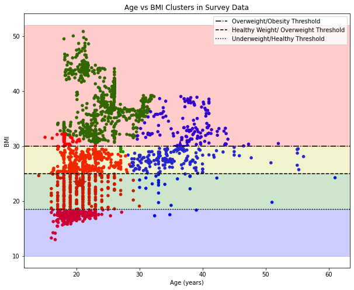

#  Project 5: Group Project

### By: Ryan Pedersen, Rick Powell, Samuel Hewitt

## Problem Statement
Obesity is an issue that affects people worldwide. While there are many factors that affect obesity rates, this project will utilize lifestyle survey data to predict if somebody is obese, and give personalized recommendations based on the factors that most contribute to their obesity.

## Data:
The data used for this project was taken from the following datasets:
* [`survey.csv`](./data/survey.csv): Dataset of Survey Results for Obesity in Mexico, Peru and Columbia from 2019 [source](https://archive.ics.uci.edu/ml/datasets/Estimation+of+obesity+levels+based+on+eating+habits+and+physical+condition+) 
* [`cleaned_cdc_2020.csv`](./data/cleaned_cdc_2020.csv): CDC Dataset of adult's diet, physical activity, and weight status from Behavioral Risk Factor Surveillance System. [source](https://chronicdata.cdc.gov/Nutrition-Physical-Activity-and-Obesity/Nutrition-Physical-Activity-and-Obesity-Behavioral/hn4x-zwk7) 

## Software Requirements:
All data cleaning and modeling was run in Python using the following libraries:
Pandas, skLearn, matplotlib, Seaborn, & Geopandas

## Data Dictionaries

### Survey Data Dictionary

| Feature | Type  | Question | Responses |
|------|------|--------|---------|
|Gender | category (one-hot encoded) | ¿What is your gender? | Female / Male |
|Age | float | ¿What is your age? | Numeric Value (years) |
|Height | float | ¿What is your height? | Numeric Value (meters) |
|Weight | float | ¿What is your weight? | Numeric Value (kg) |
|fam_hx_overweight | category | ¿Has a family member suffered or suffers from overweight? | Yes / No |
|high_cal_foods| category | ¿Do you eat high caloric food frequently? | Yes / No |
|vegetables| category | ¿Do you usually eat vegetables in your meals?| Never / Sometimes / Always |
|main_meals| int | ¿How many main meals do you have daily?| Numeric Value |
|food_bw_meals| category (one-hot encoded) | ¿Do you eat any food between meals? | No / Sometimes / Frequently / Always |
|smoke| category | ¿Do you smoke? | Yes / No |
|H2O| category | ¿How much water do you drink daily? | Less than a liter / Between 1 and 2 L / More than 2 L |
|monitor_cals| category | ¿Do you monitor the calories you eat daily? | Yes / No |
|physical_activity| category | ¿How often do you have physical activity? | None / 1 to 2 days / 2 to 4 days / 4 or more days |
|tech_use| category | ¿How much time do you use technological devices such as cell phone, videogames, television, computer and others? | 0-2 hours / 3-5 hours / More than 5 hours |
|alcohol| category (one-hot encoded) | ¿how often do you drink alcohol? | I do not drink / Sometimes / Frequently / Always |
|transport| category (one-hot encoded) | ¿Which transportation do you usually use? | Automobile / Motorbike / Bike / Public Transportation / Walking |

### CDC Data Dictionary

|Feature|Type|Dataset|Description|
|---|---|---|---|
|**Year**|*int*|CDC|Year data collected|
|**LocationAbbr**|*str*|CDC|State Abbreviation|
|**LocationDesc**|*str*|CDC|State Name|
|**Data_Value**|*float*|CDC|Percentage of people with obesity|
|**Sample_Size**|*float*|CDC|Survey sample size|
|**GeoLocation**|*tuple*|CDC|Latitude and Longitude of State|
|**QuestionID**|*str*|CDC|ID for Questions|
|**StratificationCategoryId1**|*str*|CDC|Category ID for Stratifications|
|**StratificationID1**|*str*|CDC|Stratification ID|

### CDC Question Data Dictionary

|QuestionID|Question|Dataset|
|---|---|---|
|**Q036**|Percent of adults aged 18 years and older who have obesity|CDC|
|**Q037**|Percent of adults aged 18 years and older who have an overweight classification|CDC|
|**Q047**|Percent of adults who engage in no leisure-time physical activity|CDC|
|**Q046**|Percent of adults who engage in muscle-strengthening activities on 2 or more days a week|CDC|
|**Q043**|Percent of adults who achieve at least 150 minutes a week of moderate-intensity aerobic physical activity or 75 minutes a week of vigorous-intensity aerobic activity (or an equivalent combination)|CDC|
|**Q044**|Percent of adults who achieve at least 150 minutes a week of moderate-intensity aerobic physical activity or 75 minutes a week of vigorous-intensity aerobic physical activity and engage in muscle-strengthening activities on 2 or more days a week|CDC|
|**Q045**|Percent of adults who achieve at least 300 minutes a week of moderate-intensity aerobic physical activity or 150 minutes a week of vigorous-intensity aerobic activity (or an equivalent combination)|CDC|
|**Q018**|Percent of adults who report consuming fruit less than one time daily|CDC|
|**Q019**|Percent of adults who report consuming vegetables less than one time daily|CDC|

### CDC Stratification Data Dictionary

|StratificationCategory1|Stratification1|StratificationCategoryID1|StratificationID1|Dataset|
|---|---|---|---|---|
|**Age(years)**|18 - 24|AGEYR|AGEYR1824|CDC|
|**Age(years)**|25 - 34|AGEYR|AGEYR2534|CDC|
|**Age(years)**|35 - 44|AGEYR|AGEYR3544|CDC|
|**Age(years)**|45 - 54|AGEYR|AGEYR4554|CDC|
|**Age(years)**|55 - 64|AGEYR|AGEYR5564|CDC|
|**Age(years)**|65 or older|AGEYR|AGEYR65PLUS|CDC|
|**Education**|College graduate|EDU|EDUCOGRAD|CDC|
|**Education**|Some college or technical school|EDU|EDUCOTEC|CDC|
|**Education**|Less than high school|EDU|EDUHS|CDC|
|**Education**|High school graduate |EDU|EDUHSGRAD|CDC|
|**Gender**|Female|GEN|FEMALE|CDC|
|**Gender**|Male|GEN|MALE|CDC|
|**Income**|$15,000 - $24,999|INC|INC1525|CDC|
|**Income**|$25,000 - $34,999|INC|INC2535|CDC|
|**Income**|$35,000 - $49,999|INC|INC3550|CDC|
|**Income**|$50,000 - $74,999|INC|INC5075|CDC|
|**Income**|$75,000 or greater|INC|INC75PLUS|CDC|
|**Income**|Data not reported|INC|INCNR|CDC|
|**Race/Ethnicity**|2 or more races|RACE|RACE2PLUS|CDC|
|**Race/Ethnicity**|Asian|RACE|RACEASN|CDC||
|**Race/Ethnicity**|Non-Hispanic Black|RACE|RACEBLK|CDC|
|**Race/Ethnicity**|Hispanic|RACE|RACEHIS|CDC|
|**Race/Ethnicity**|Hawaiian/Pacific Islander|RACE|RACEHPI|CDC|
|**Race/Ethnicity**|American Indian/Alaska Native|RACE|RACENAA|CDC|
|**Race/Ethnicity**|Other|RACE|RACEOTH|CDC|
|**Race/Ethnicity**|Non-Hispanic White |RACE|RACEWHT|CDC|
|**Total**|Total|OVR|OVERALL|CDC|

## Modeling:

### Survey Regression Model:

The goal of the regression model was to predict a person's weight based upon their answers in the survey. The best performing model was random forest. Feature engineering was performed by creating 2nd degree polynomial features on height, high_cal_foods, vegetables, main_meals, and h2o columns. This model had a mean squared error of 94.9 and a training and testing r2 score of .987 and .866 respectively.

### Survey Classification Models:

For our classifications models, we set up two separate models. The first was just to determine whether a person was overweight/obese or not. For this classification, our best model was a RandomForest model, with an accuracy score of .930 for the test data set. Although the model might appear to be overfit (the training accuracy was 1.0), the RandomForest model had the best test accuracy and the fewest miscategorized predictions. Therefore, we chose this as our production model. Our second classification model was a multiclass model, where we split up our categories into 4 classes: Underweight, Normal Weight, Overweight, and Obese. Similar to our first model, the RandomForest model had our best accuracy, with a test score of .881. This model also had some issues with overfitting, but again the test score was much better than any of the other models, so we chose this RandomForest model as our production model.

### CDC Regression Model:

The goal of the regression model was to predict a state's obesity percentage based on diet and exercise habits. The best performing model was knn with n = 8 with a mean squared error of 6.46. The r2 for the training and testing sets were .670 and .592 respectively.  

### Survey KMeans Clustering:

The goal of KMeans clustering was to find different clusters of data correlating age to BMI (Body Mass Index). The largest silhouette score was of 0.494 occured at 3 clusters.

## Conclusion:

Daily Exercise and a Healthy diet are obvious ways to reduce obesity, but simple lifestyle changes such as biking or walking to work (if possible), drinking less alcohol, or monitoring the calories you eat can help manage your weight.

## Next Steps:

We could improve our results with more data points, our survey had over 2000 responses, but our models and predictions would have been better with more data. Additionally, our CDC data set had many null values that made modeling difficult, and all the values were percent based.
